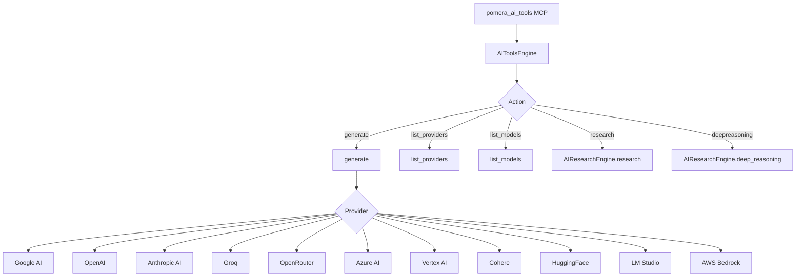
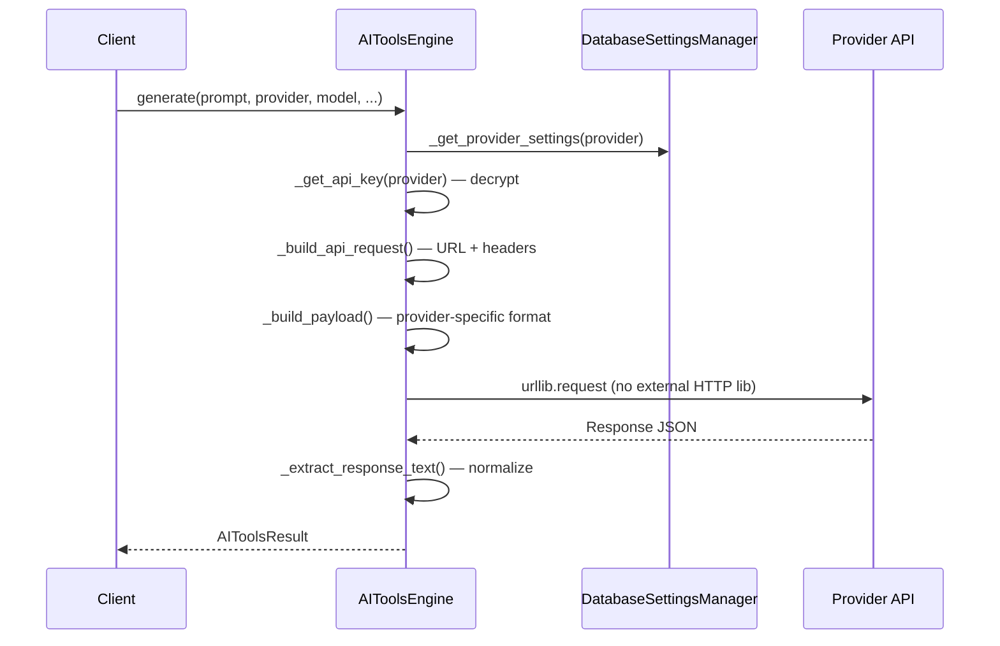

# API Tools Architecture

> Multi-provider AI abstraction, research/deep reasoning actions, web search engine abstraction, and URL content reader.

---

## Overview

Pomera exposes AI capabilities through three engines:

1. **`AIToolsEngine`** — Core AI text generation across 11 providers
2. **`AIResearchEngine`** — Research with web search + deep reasoning
3. **Web Search** — Multi-engine web search (Tavily, Exa, Google, Brave, DuckDuckGo, SerpAPI, Serper)

---

## AI Tools Engine (`core/ai_tools_engine.py`)

### Provider Architecture

### 11 Supported Providers

| Provider | API Style | Auth | Notable |
|----------|-----------|------|---------|
| Google AI | REST | API key | Gemini models |
| OpenAI | REST | API key | GPT-5.2 uses Responses API |
| Anthropic AI | REST | API key | Claude, Extended Thinking |
| Groq | OpenAI-compatible | API key | Fast inference |
| OpenRouter | OpenAI-compatible | API key | Model aggregator |
| Azure AI | REST | API key + endpoint | Enterprise |
| Vertex AI | REST | OAuth2 service account | Google Cloud |
| Cohere | REST | API key | Command models |
| HuggingFace | REST | API key | Open models |
| LM Studio | OpenAI-compatible | None (local) | Local models |
| AWS Bedrock | REST | AWS credentials | AWS-hosted models |

### Request Building Pipeline

**Key design**: Uses `urllib.request` — no dependency on `requests`, `httpx`, or `aiohttp`. Pure standard library.

### Parameter Support

| Parameter | Type | Description |
|-----------|------|-------------|
| `prompt` | str | Input text |
| `provider` | str | Provider name |
| `model` | str | Model name (optional, uses default) |
| `system_prompt` | str | System instruction |
| `temperature` | float | Sampling temperature (0.0-2.0) |
| `top_p` | float | Nucleus sampling |
| `top_k` | int | Top-k sampling |
| `max_tokens` | int | Max output tokens |
| `stop_sequences` | list | Stop sequences |
| `seed` | int | Random seed |
| `prompt_is_file` | bool | Load prompt from file path |
| `output_to_file` | str | Save response to file |

---

## Research Engine (`core/ai_research_engine.py`)

### Research Action

Supports OpenAI, Anthropic AI, and OpenRouterAI with provider-native web search:

| Provider | Model | Web Search Method |
|----------|-------|-------------------|
| OpenAI | GPT-5.2 | `web_search` tool in Responses API |
| Anthropic | Claude Opus 4.5 | `web_search_20250305` tool |
| OpenRouter | Various | Provider routing with search |

**Modes**: `two-stage` (search → reason) or `single` (combined)

### Deep Reasoning Action

Anthropic-only. Uses Claude Extended Thinking with a 6-step protocol:
1. **DECOMPOSE** — Break problem into components
2. **SEARCH** — Gather relevant information
3. **DECIDE** — Choose analytical approach
4. **ANALYZE** — Deep analysis
5. **VERIFY** — Cross-check conclusions
6. **SYNTHESIZE** — Combine into answer

Thinking budget configurable: 1K–128K tokens.

---

## Web Search (`tools/web_search.py`)

### Engine Abstraction

| Engine | Free Tier | Best For |
|--------|-----------|----------|
| Tavily | 1000/mo | Default, AI-optimized |
| Exa | varies | Neural/semantic search |
| Google | 100/day | Complex queries |
| Brave | 2000/mo | General fallback |
| DuckDuckGo | Unlimited | No API key needed |
| SerpAPI | 100 total | Google SERP data |
| Serper | 2500 total | Google SERP data |

Available via both MCP (`pomera_web_search`) and CLI (`python tools/web_search.py`).

---

## URL Content Reader (`tools/url_content_reader.py`)

Fetches URL content and converts HTML to clean Markdown. Features:
- Main content extraction (strips nav, footer, ads)
- Timeout configuration (5-120 seconds)
- File output support
- Available via MCP as `pomera_read_url`

---

## Design Decisions

1. **No HTTP library dependency**: Uses `urllib.request` — works everywhere, no installation needed
2. **Provider settings from DB**: API keys and model lists stored in `database_settings_manager`, encrypted at rest
3. **Research is separate engine**: Complex multi-step research is isolated from simple generation to keep `AIToolsEngine` focused
4. **Web search is multi-engine**: Different engines have different strengths; user picks or uses defaults
5. **API key decryption at call time**: Keys are decrypted only when needed, never cached in plaintext
