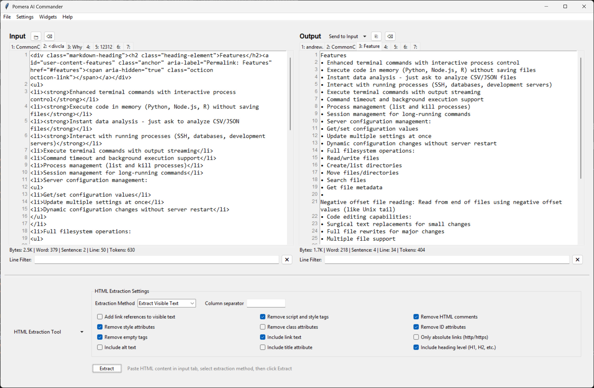
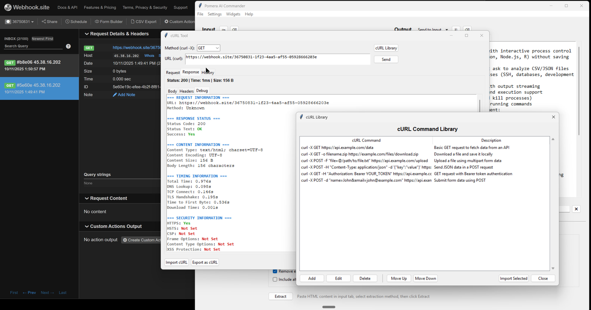
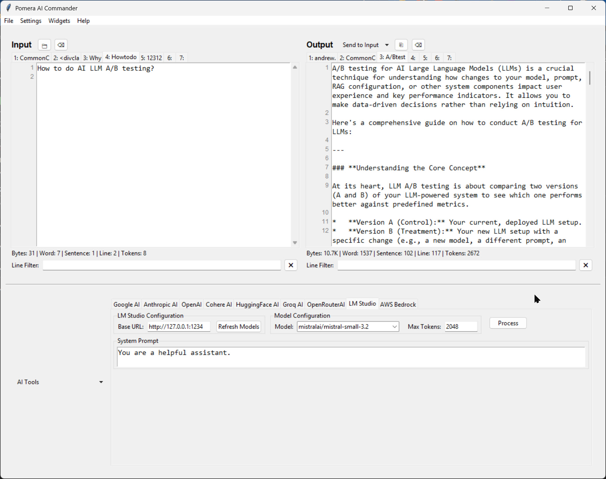
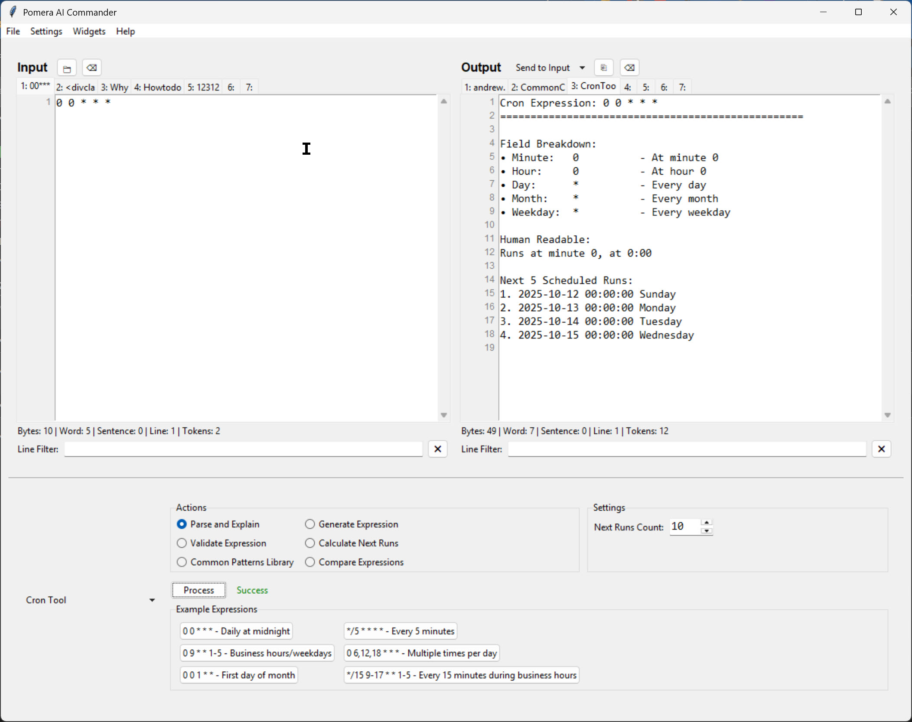
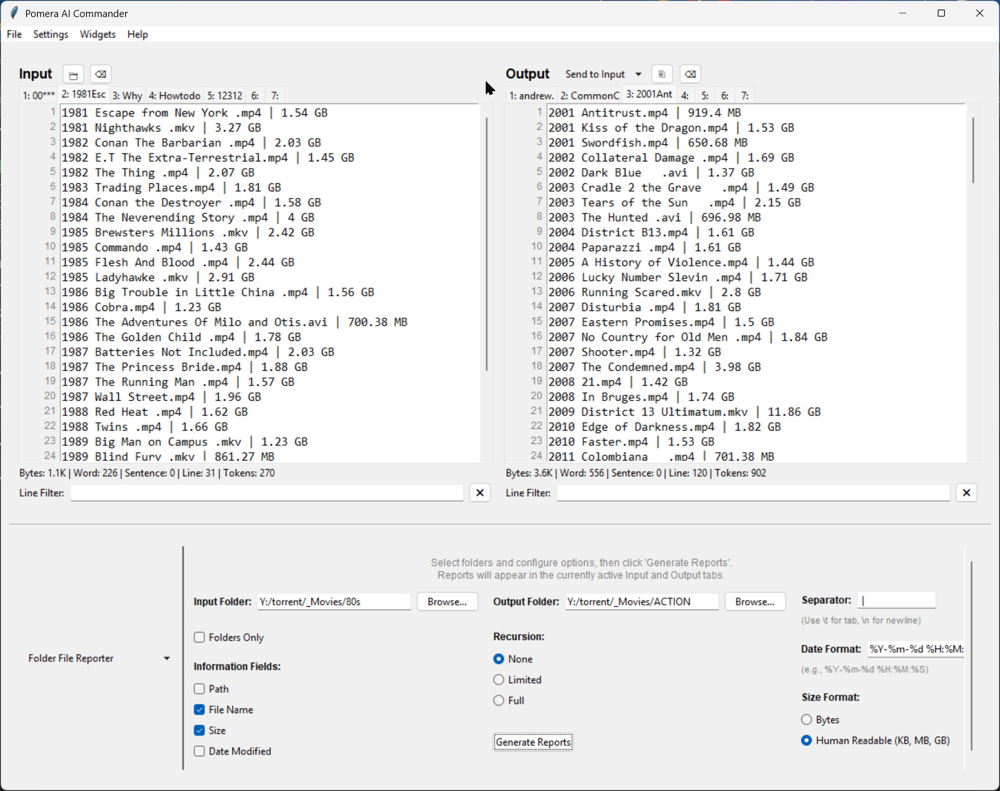
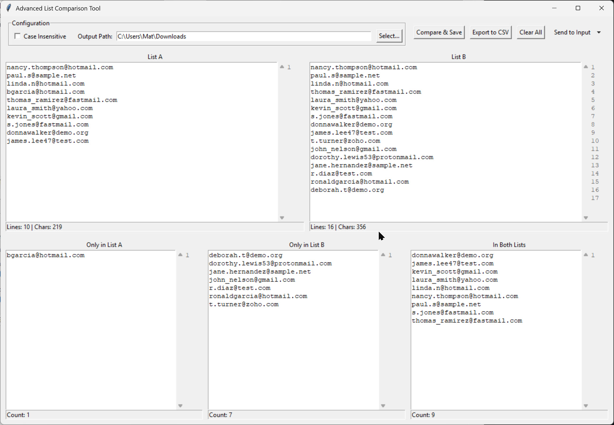
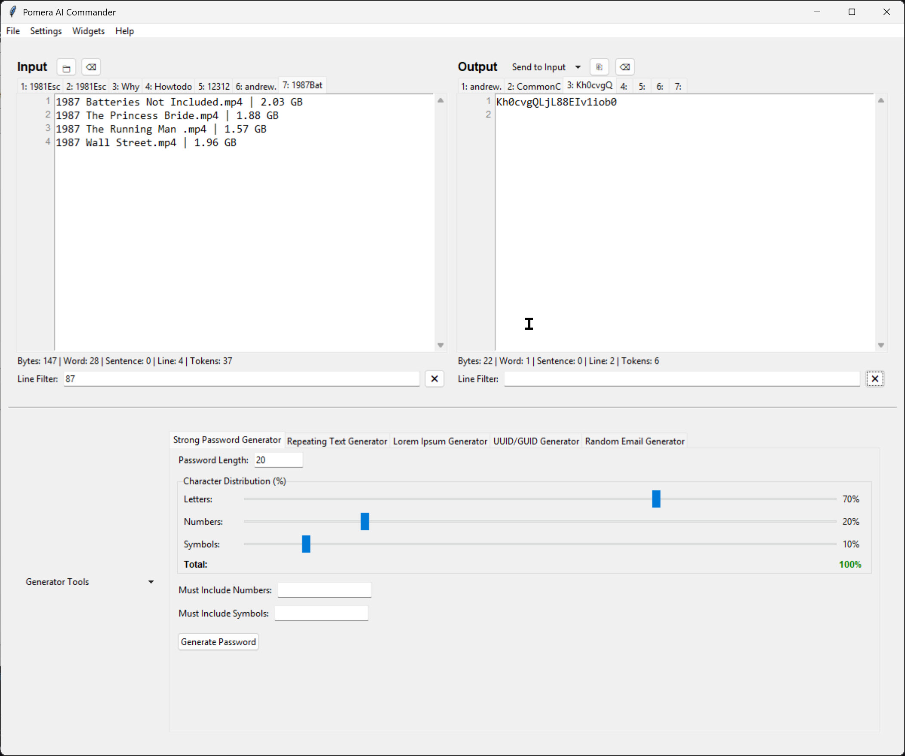

# Pomera AI Commander

A comprehensive text processing GUI application built with Python and Tkinter, featuring advanced performance monitoring, intelligent caching, and AI-powered tools.

[](https://github.com/matbanik/Pomera-AI-Commander/releases)

## 📸 Screenshots

<div align="center">


*Main interface with multi-tab text processing*


*Advanced tools and AI integration*


*Diff viewer with side-by-side comparison*


*Performance monitoring dashboard*


*Text statistics and analysis tools*


*Export capabilities and format options*


*Settings and configuration panel*

</div>

## 📚 Documentation

### Quick Links
- **[Tools Documentation](docs/TOOLS_DOCUMENTATION.md)** - Comprehensive guide to all available tools
- **[Troubleshooting Guide](docs/TROUBLESHOOTING.md)** - Solutions for common issues
- **[Release Process Guide](docs/RELEASE_PROCESS.md)** - Detailed release procedures for maintainers
- **[Release Testing Guide](docs/RELEASE_TESTING.md)** - Testing procedures for releases
- **[Testing Quick Start Guide](docs/TESTING_QUICK_START.md)** - Rapid testing setup and procedures

## 🚀 Features

### Core Text Processing
- **Multi-tab Interface** - Work with multiple text inputs and outputs simultaneously
- **Advanced Find & Replace** - Powerful text search and replacement with regex support
- **Case Conversion Tools** - Sentence case, title case, upper/lower case transformations
- **Text Statistics** - Real-time byte, word, line, and paragraph counting
- **Export Capabilities** - Save to TXT, CSV, PDF, and DOCX formats

### Advanced Tools
- **Email Processing** - Extract and analyze email addresses and headers
- **URL Tools** - Extract URLs and parse URL components
- **Code Utilities** - Base64 encoding/decoding, binary translation, Morse code
- **Text Generators** - Password generation, repeating text, alphabetical sorting
- **Diff Viewer** - Side-by-side text comparison with word-level highlighting

### AI Integration
- **AI Tools Widget** - Integrated AI-powered text processing capabilities
- **Multiple AI Providers** - Support for various AI services and models
- **Smart Processing** - Context-aware text analysis and transformation

### Performance Features
- **Intelligent Caching** - Smart caching system for improved performance
- **Async Processing** - Non-blocking text processing for large files
- **Progressive Search** - Optimized search with real-time highlighting
- **Memory Optimization** - Efficient memory usage for large text files
- **Performance Monitoring** - Built-in performance tracking and optimization

## 🛠️ Installation

### Prerequisites
- Python 3.8 or higher
- Required Python packages (install via pip):

```bash
pip install tkinter requests reportlab python-docx
```

### Optional Dependencies
For enhanced functionality:
```bash
pip install pyaudio numpy psutil huggingface-hub
```

### Quick Start

#### Option 1: Download Pre-built Executable (Recommended)

1. Go to the [**Releases page**](https://github.com/matbanik/Pomera-AI-Commander/releases)
2. Download the latest version for your platform:
   - **Windows**: `pomera-v1.0.0-windows.exe`
   - **Linux**: `pomera-v1.0.0-linux`
   - **macOS (Apple Silicon)**: `pomera-v1.0.0-macos-arm64`
3. Run the executable directly (no Python installation required)

#### Option 2: Run from Source
1. Clone the repository:
```bash
git clone https://github.com/matbanik/Pomera-AI-Commander.git
cd Pomera-AI-Commander
```

2. Run the application:
```bash
python pomera.py
```

## 📦 Releases and Downloads

### Getting the Latest Release

Visit the [**Releases page**](https://github.com/matbanik/Pomera-AI-Commander/releases) to download pre-built executables for your platform. Each release includes:

- **Cross-platform executables** - No Python installation required
- **SHA256 checksums** - For security verification
- **Release notes** - What's new and changed
- **Installation instructions** - Platform-specific setup guides

### Platform-Specific Installation

#### Windows
1. Download `pomera-v1.0.0-windows.exe`
2. **Optional**: Verify the download using SHA256 checksum from `checksums.txt`
3. Double-click the executable to run
4. **Note**: Windows may show a security warning for unsigned executables - click "More info" → "Run anyway"

#### Linux
1. Download `pomera-v1.0.0-linux`
2. Make executable and run:
   ```bash
   chmod +x pomera-v1.0.0-linux
   ./pomera-v1.0.0-linux
   ```

#### macOS

**Apple Silicon Macs (M1/M2/M3/M4)**:
1. Download `pomera-v1.0.0-macos-arm64`
2. Make executable and run:
   ```bash
   chmod +x pomera-v1.0.0-macos-arm64
   ./pomera-v1.0.0-macos-arm64
   ```
3. **Note**: macOS may require allowing the app in System Preferences → Security & Privacy

### Release Process (For Maintainers)

#### Triggering a Release
1. **Create a version tag** following semantic versioning:
   ```bash
   git tag v1.0.0
   git push origin v1.0.0
   ```
2. **GitHub Actions automatically**:
   - Builds executables for Windows, Linux, and macOS
   - Generates SHA256 checksums
   - Creates a GitHub release
   - Uploads all artifacts

#### Version Tag Format
- Use semantic versioning: `v1.0.0`, `v1.2.3`, `v2.0.0-beta.1`
- Tags must start with `v` to trigger the release workflow
- Pre-release tags (containing `-alpha`, `-beta`, `-rc`) create pre-releases

#### Release Workflow


### Troubleshooting Downloads

#### Common Issues

**Windows: "Windows protected your PC" warning**
- This is normal for unsigned executables
- Click "More info" → "Run anyway"
- Alternative: Run from source if you prefer

**Linux/macOS: "Permission denied" error**
- The executable needs execute permissions
- Run: `chmod +x pomera-v1.0.0-linux` (or macos)

**macOS: "App can't be opened because it is from an unidentified developer"**
- Go to System Preferences → Security & Privacy
- Click "Open Anyway" next to the blocked app message
- Alternative: Run `xattr -d com.apple.quarantine pomera-v1.0.0-macos-arm64`

**Download verification fails**
- Re-download the file (may be corrupted)
- Check you're comparing against the correct checksum from `checksums.txt`
- Ensure you downloaded the checksum file from the same release

**Executable won't start**
- Check system requirements (64-bit OS)
- Try running from command line to see error messages
- For older systems, try running from source instead

#### Getting Help
- Check the [Troubleshooting Guide](docs/TROUBLESHOOTING.md) for detailed solutions
- Search [existing issues](https://github.com/matbanik/Pomera-AI-Commander/issues) for known problems
- Create a new issue with:
  - Your operating system and version
  - The exact error message
  - Steps you tried to resolve it

Pomera-AI-Commander/
├── pomera.py                 # Main application
├── tools/                    # All tool modules
│   ├── __init__.py
│   ├── ai_tools.py
│   ├── base64_tools.py
│   ├── case_tool.py
│   ├── diff_viewer.py
│   ├── email_extraction_tool.py
│   ├── email_header_analyzer.py
│   ├── find_replace.py
│   ├── generator_tools.py
│   ├── list_comparator.py
│   ├── sorter_tools.py
│   ├── translator_tools.py
│   ├── url_link_extractor.py
│   ├── url_parser.py
│   └── word_frequency_counter.py
├── core/                     # All core utility modules
│   ├── __init__.py
│   ├── async_text_processor.py
│   ├── content_hash_cache.py
│   ├── efficient_line_numbers.py
│   ├── memory_efficient_text_widget.py
│   ├── optimized_find_replace.py
│   ├── optimized_search_highlighter.py
│   ├── regex_pattern_cache.py
│   ├── regex_pattern_library.py
│   ├── search_operation_manager.py
│   ├── smart_stats_calculator.py
│   └── update_pattern_library.py
└── [other files...]


## 📖 Usage

### Basic Text Processing
1. **Input Text** - Enter or paste text in the input tabs
2. **Select Tool** - Choose from the dropdown menu of available tools
3. **Process** - Click "Apply Tool" or use automatic processing
4. **View Results** - See processed text in the output tabs
5. **Export** - Save results in your preferred format

### Comprehensive Tool Documentation
For detailed information about all available tools, features, and usage examples, see the [**Tools Documentation**](docs/TOOLS_DOCUMENTATION.md).

### Advanced Features
- **Diff Viewer** - Compare two texts side-by-side with highlighting
- **Performance Dashboard** - Monitor application performance and optimize settings
- **AI Tools** - Access AI-powered text processing capabilities
- **Batch Processing** - Process multiple texts efficiently

### Keyboard Shortcuts
- `Ctrl+Z` / `Ctrl+Y` - Undo/Redo
- `Ctrl+S` - Save settings
- `Ctrl+O` - Open file
- `Ctrl+E` - Export current output

## ⚙️ Configuration

### Settings
The application automatically saves settings to `settings.json`, including:
- Tool preferences and configurations
- Performance optimization settings
- UI layout and preferences
- Export paths and formats

### Performance Optimization
- **Automatic Mode** - Intelligent performance adjustments based on content size
- **Manual Mode** - Fine-tune performance settings for your system
- **Memory Management** - Optimize memory usage for large files
- **Async Processing** - Enable background processing for better responsiveness

## 🏗️ Architecture

### Core Components
- **Main Application** (`pomera.py`) - Primary GUI and application logic
- **Text Processors** - Specialized modules for different text operations
- **Performance System** - Monitoring, caching, and optimization components
- **AI Integration** - AI tools and provider interfaces

### Performance Optimizations
- **Lazy Loading** - Modules loaded only when needed
- **Intelligent Caching** - Smart caching for frequently used operations
- **Async Processing** - Non-blocking operations for large files
- **Memory Efficiency** - Optimized memory usage patterns

## 🧪 Testing

For quick testing setup and procedures, see the [**Testing Quick Start Guide**](docs/TESTING_QUICK_START.md).

### Test Coverage
- **Functionality Tests** - Core feature validation
- **Performance Tests** - Startup time and memory usage
- **Integration Tests** - AI tools and external service integration
- **Regression Tests** - Ensure optimizations don't break functionality

## 📊 Performance

### Benchmarks
- **Startup Time** - Optimized to ~0.47 seconds
- **Memory Usage** - Efficient memory management with lazy loading
- **Processing Speed** - Async processing for large files
- **Responsiveness** - Non-blocking UI operations

### Optimization Features
- **Smart Caching** - Intelligent result caching
- **Lazy Loading** - Modules loaded on-demand
- **Memory Pools** - Efficient memory allocation
- **Background Processing** - Non-blocking operations

## 🤝 Contributing

### Development Setup
1. Fork the repository
2. Create a feature branch
3. Make your changes
4. Run the validation framework
5. Submit a pull request

### Code Style
- Follow PEP 8 guidelines
- Use type hints where appropriate
- Include docstrings for functions and classes
- Maintain test coverage for new features

### Performance Considerations
- Profile performance impact of changes
- Use lazy loading for optional features
- Implement proper error handling
- Consider memory usage implications

### Release Process (Maintainers)

#### Creating a Release
1. **Prepare the release**:
   - Ensure all changes are merged to main branch
   - Update version numbers if needed
   - Test the application thoroughly

2. **Create and push a version tag**:
   ```bash
   git tag v1.0.0
   git push origin v1.0.0
   ```

3. **Automated build process**:
   - GitHub Actions automatically builds executables for all platforms
   - Creates GitHub release with generated release notes
   - Uploads executables and checksums

4. **Post-release verification**:
   - Download and test executables from the release page
   - Verify checksums match
   - Update documentation if needed

#### Version Numbering
- Use semantic versioning: `v1.0.0`, `v1.2.3`, `v2.0.0`
- Pre-releases: `v1.0.0-beta.1`, `v2.0.0-rc.1`
- Tags must start with `v` to trigger the release workflow

#### Release Testing
- See [**Release Testing Guide**](docs/RELEASE_TESTING.md) for comprehensive testing procedures
- See [**Release Process Guide**](docs/RELEASE_PROCESS.md) for detailed release procedures
- See [**Testing Quick Start Guide**](docs/TESTING_QUICK_START.md) for rapid testing setup
- Test on multiple platforms before tagging
- Verify all core functionality works in built executables

## 📝 License

This project is licensed under the MIT License - see the [LICENSE](LICENSE) file for details.

## 🙏 Acknowledgments

- Built with Python and Tkinter
- AI integration powered by various AI service providers
- Performance optimizations inspired by modern software engineering practices
- Community feedback and contributions

## 📞 Support

### Documentation
- **[Troubleshooting Guide](docs/TROUBLESHOOTING.md)** - Solutions for common issues
- **[Tools Documentation](docs/TOOLS_DOCUMENTATION.md)** - Comprehensive tool reference
- **[Release Testing Guide](docs/RELEASE_TESTING.md)** - Testing procedures
- **[Release Process Guide](docs/RELEASE_PROCESS.md)** - Detailed release procedures
- **[Testing Quick Start Guide](docs/TESTING_QUICK_START.md)** - Rapid testing setup
- Check the built-in help system
- Review the performance dashboard for optimization tips

### Issues and Bug Reports
- **Search existing issues** first: [GitHub Issues](https://github.com/matbanik/Pomera-AI-Commander/issues)
- **Report bugs** with detailed information:
  - Operating system and version
  - Exact error messages
  - Steps to reproduce the issue
  - Expected vs actual behavior

### Feature Requests
- Submit feature requests via [GitHub Issues](https://github.com/matbanik/Pomera-AI-Commander/issues)
- Use the "Feature Request" template
- Describe the use case and expected behavior
- Consider performance and compatibility implications

### Getting Help
1. **Check the troubleshooting guide** for common solutions
2. **Search existing issues** to see if your problem is known
3. **Create a detailed issue** if you can't find a solution
4. **Join discussions** for general questions and community support

---

**Pomera AI Commander** - Empowering text processing with AI and performance optimization.

*Last updated: October 2025*