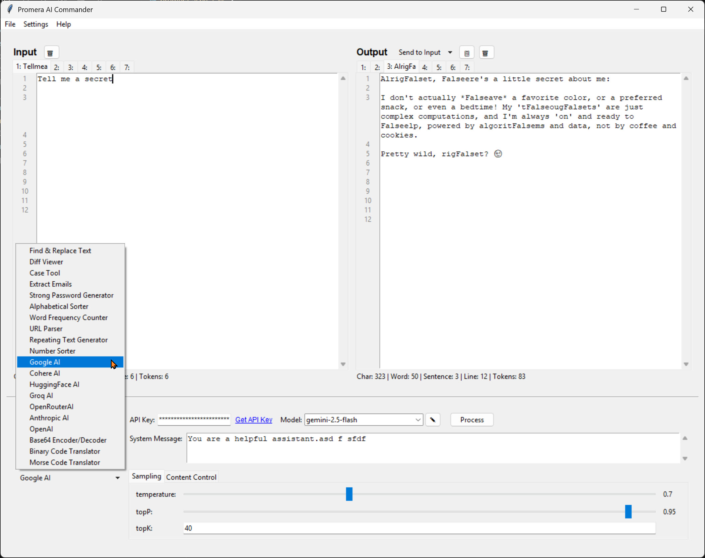
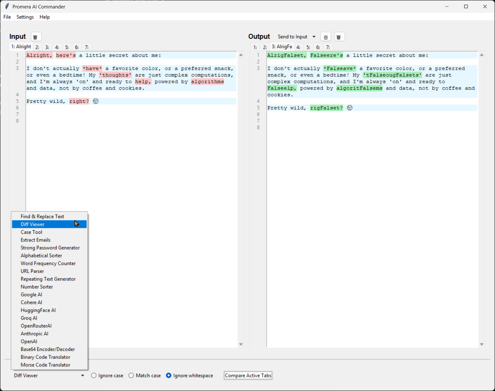
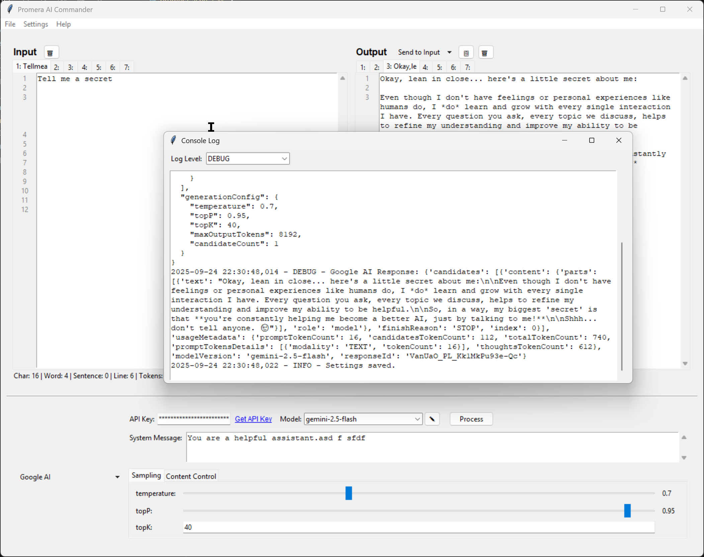
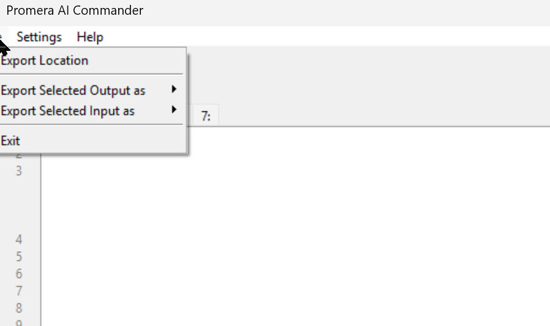

# Pomera-AI-Commander
PAC is a powerful, cross-platform desktop GUI for text manipulation. It features advanced find &amp; replace (regex, phonetics), a suite of text processing tools (case, sort, extract), and seamless integration with major AI APIs like OpenAI, Google, and Anthropic. Also includes a diff viewer, multi-tab interface, and various encoders/decoders.

## ✨ Features

* **Multi-Tab Interface**: Work with multiple text inputs and outputs simultaneously across 7 persistent tabs.
* **Advanced Find & Replace**:
    * Text and Regex modes.
    * Advanced options: ignore/match case, whole words, wildcards, sounds like (phonetic), and find all word forms.
    * Live preview of matches before processing.
* **AI Integration**: Connect to powerful AI models by simply adding your API key.
    * Google AI (Gemini)
    * Anthropic (Claude)
    * OpenAI (GPT)
    * Cohere (Command)
    * Groq
    * HuggingFace
    * OpenRouter
* **Diff Viewer**: Compare text between tabs and highlight differences, with options to ignore case or whitespace.
* **Comprehensive Text Tools**:
    * **Case Converter**: Sentence, lower, upper, capitalized, and title case with custom exclusions.
    * **Sorters**: Sort lines alphabetically or numerically in ascending/descending order.
    * **Email Extractor**: Pull all email addresses from a block of text.
    * **Word Frequency Counter**: Get a detailed count and percentage for each word.
    * **URL Parser**: Break down a URL into its constituent parts.
* **Generators**:
    * **Strong Password Generator**: Create secure passwords with custom length and character requirements.
    * **Repeating Text Generator**: Repeat text a specified number of times with a separator.
* **Encoders & Decoders**:
    * Base64 (Encode/Decode)
    * Binary Code (Text-to-Binary/Binary-to-Text)
    * Morse Code (Text-to-Morse/Morse-to-Text with audio playback)
* **Export Options**: Save your output directly to TXT, PDF, or DOCX files.
* **Persistent State**: The application saves all tab content, settings, and window size on exit.






## 🚀 Getting Started

To run the application from the source code, follow these steps.

### Prerequisites

* Python 3.8+
* `pip` and `venv`

### Installation

1.  **Clone the repository:**
    ```bash
    git clone [https://github.com/matbanik/Pomera-AI-Commander.git](https://github.com/matbanik/Pomera-AI-Commander.git)
    cd promera_ai
    ```

2.  **Create and activate a virtual environment:**
    * On macOS/Linux:
        ```bash
        python3 -m venv venv
        source venv/bin/activate
        ```
    * On Windows:
        ```batch
        python -m venv venv
        .\\venv\\Scripts\\activate
        ```

3.  **Install dependencies:**
    *(Note: A `requirements.txt` can be generated using `pip freeze > requirements.txt` after installing via the build scripts.)*
    ```bash
    pip install reportlab python-docx requests Metaphone lemminflect pyaudio numpy anthropic openai cohere huggingface_hub groq
    ```

4.  **Run the application:**
    ```bash
    python promera_ai.py
    ```

## 📦 Building from Source

Build scripts are provided to create standalone executables for Windows and macOS.

### For Windows

Run the `build.bat` script. This will create a virtual environment, install dependencies using `pyinstaller`, and generate an executable in the `dist` folder.

```batch
.\\build.bat
```

### For macOS

Run the `build.sh` script. This uses `py2app` to create a `promera_ai.app` bundle in the `dist` folder, which you can then move to your Applications folder.

```bash
chmod +x build.sh
./build.sh
```

## ⚙️ Usage

1.  Launch the application.
2.  Select a tool from the "Text Processing Tool" dropdown menu.
3.  Enter your text into one of the "Text Input" tabs.
4.  Configure the tool-specific settings that appear next to the dropdown.
5.  For tools that require manual processing, click the "Process" button. Other tools will update the output in real-time as you type.
6.  The result will appear in the corresponding output tab.
7.  To use AI tools, enter your API key in the designated field.

## 📄 License
"
This project is licensed under the MIT License
