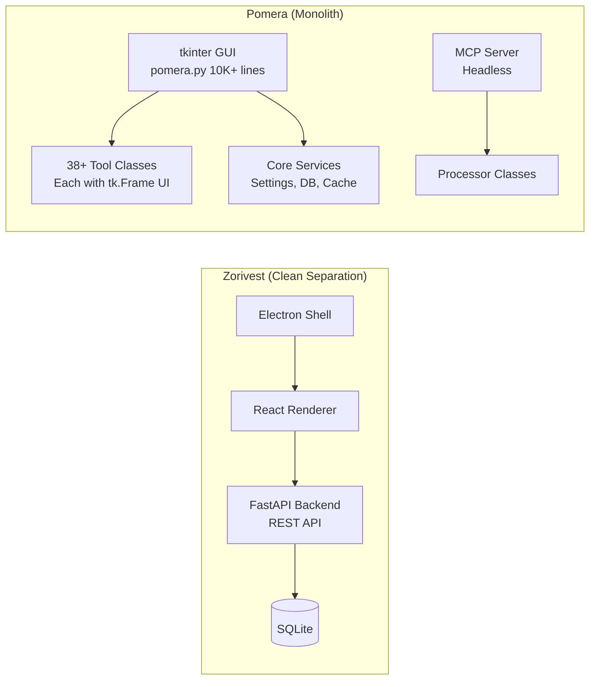
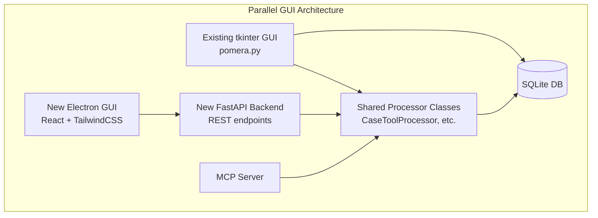

# Pomera GUI Modernization Analysis: Adding Electron+React UI

## Summary

You want to add a zorivest-style **Electron + React + TailwindCSS** GUI to Pomera AI Commander, which currently uses **Python tkinter**. This analysis reviews both architectures and identifies the key considerations.

---

## Architecture Comparison

### Zorivest Stack
| Layer | Technology |
|-------|-----------|
| Desktop Shell | **Electron 41** (Chromium-based) |
| Frontend Framework | **React 19** + TypeScript |
| State Management | **Zustand 5** (stores) |
| Routing | **TanStack Router** (hash-based, lazy routes) |
| Data Fetching | **TanStack React Query** |
| Styling | **TailwindCSS 4** + Radix UI primitives |
| UI Components | Radix UI, CodeMirror, Lucide icons |
| Backend | **Python FastAPI** (uvicorn) — separate process |
| IPC | Electron IPC bridge + REST API |
| Build | electron-vite, electron-builder |

### Pomera Current Stack
| Layer | Technology |
|-------|-----------|
| Desktop Shell | **Python tkinter** (monolith — GUI is the app) |
| Frontend | tkinter widgets (native OS look) |
| State | In-memory Python dicts + SQLite persistence |
| Tools | 38+ tool classes, all inheriting `BaseTool` with `tk.Frame` UI |
| Backend Logic | Embedded in same process (no API separation) |
| MCP Server | Separate headless process ([pomera_mcp_server.py](file:///p:/Pomera-AI-Commander/pomera_mcp_server.py)) |
| Build | PyInstaller spec files |

---

## Key Architectural Differences

---

## Critical Findings

### 🟢 Good News: Separation Already Exists (Partially)

Pomera already has a **Processor pattern** that separates business logic from GUI:

| Tool File | GUI Class (tkinter) | Processor Class (headless) |
|-----------|--------------------|----|
| [case_tool.py](file:///p:/Pomera-AI-Commander/tools/case_tool.py) | `CaseTool` | `CaseToolProcessor` |
| [line_tools.py](file:///p:/Pomera-AI-Commander/tools/line_tools.py) | `LineTools` | `LineToolsProcessor` |
| [whitespace_tools.py](file:///p:/Pomera-AI-Commander/tools/whitespace_tools.py) | `WhitespaceTools` | `WhitespaceToolsProcessor` |
| [string_escape_tool.py](file:///p:/Pomera-AI-Commander/tools/string_escape_tool.py) | `StringEscapeTool` | `StringEscapeProcessor` |
| [sorter_tools.py](file:///p:/Pomera-AI-Commander/tools/sorter_tools.py) | `SorterTools` | `SorterToolsProcessor` |
| [hash_generator.py](file:///p:/Pomera-AI-Commander/tools/hash_generator.py) | `HashGenerator` | `HashGeneratorProcessor` |

These processor classes are **already used by the MCP server** ([tool_registry.py](file:///p:/Pomera-AI-Commander/core/mcp/tool_registry.py)) headlessly, proving the logic can work without tkinter.

The [AppContext](file:///p:/Pomera-AI-Commander/core/app_context.py) and [ToolLoader](file:///p:/Pomera-AI-Commander/tools/tool_loader.py) provide dependency injection and lazy loading patterns that are GUI-independent in concept.

### 🔴 Bad News: Deep tkinter Coupling

1. **Every single tool file imports tkinter** — all 38 files in `tools/` have `import tkinter as tk`. The `BaseTool` base class itself requires `tk.Frame` parameters in its `create_ui()` abstract method.

2. **`pomera.py` is a 10,581-line monolith** — the `PromeraAIApp` class (starting at [line 837](file:///p:/Pomera-AI-Commander/pomera.py#L837)) extends `tk.Tk` directly. All UI layout, tool integration, settings, theming, and window management is in one file.

3. **Core modules also import tkinter** — 17 files in `core/` import tkinter, including critical services like [dialog_manager.py](file:///p:/Pomera-AI-Commander/core/dialog_manager.py), [event_consolidator.py](file:///p:/Pomera-AI-Commander/core/event_consolidator.py), [streaming_text_handler.py](file:///p:/Pomera-AI-Commander/core/streaming_text_handler.py).

4. **No REST/HTTP API layer** — Unlike zorivest which has a FastAPI backend with structured routes, Pomera has no HTTP API. The MCP server exposes tools via stdio, not HTTP.

5. **Settings are tightly coupled** — The [DatabaseSettingsManager](file:///p:/Pomera-AI-Commander/core/database_settings_manager.py) is accessed through the tkinter app instance, not through an API.

---

## Feasibility Assessment

### Option A: Add Electron UI in Parallel (Incremental)

**Effort: Large (4-8 weeks)**

This is the zorivest model. The approach:

1. **Create a FastAPI backend** exposing Pomera's processor classes as REST endpoints
2. **Build Electron + React frontend** that calls this API
3. **Keep existing tkinter GUI** working unchanged
4. **Both GUIs share** the same SQLite database and core processors

**What's needed:**
- [ ] Create `api/` directory with FastAPI app (similar to `p:\zorivest\packages\api\`)
- [ ] Create REST endpoints wrapping each Processor class
- [ ] Create `ui/` directory with Electron + React app (similar to `p:\zorivest\ui\`)
- [ ] Port settings API (expose DatabaseSettingsManager over HTTP)
- [ ] Port notes API (expose notes DB over HTTP)
- [ ] Create React versions of each tool UI
- [ ] Electron main process to manage Python backend lifecycle

**Pros:**
- Non-destructive — existing tkinter GUI keeps working
- Incremental — can port tools one at a time
- Proven pattern — zorivest already does this exact architecture
- MCP server processors are reusable immediately

**Cons:**
- 38+ tools need new React UIs
- Database locking concerns if both GUIs run simultaneously
- Significant new code to maintain (two full UIs)

### Option B: Full Refactor to Electron-Only

**Effort: Very Large (8-16 weeks)**

Replace tkinter entirely with Electron + React.

**Pros:**
- Single modern codebase
- No dual-maintenance burden
- Better cross-platform UX

**Cons:**
- Massive effort — 10K+ line main file to replace
- Breaks existing user workflows during transition
- Higher risk of regression
- All 38 tool UIs need complete rewrite

### Option C: Web UI Only (No Electron)

**Effort: Medium (3-6 weeks)**

Add a lightweight FastAPI + plain HTML/JS web UI that runs in the browser.

**Pros:**
- Simpler than Electron (no Node.js ecosystem)
- Stays in Python ecosystem
- Works on any device with a browser

**Cons:**
- Not a desktop app experience
- No system tray, file dialogs, etc.

---

## Recommendation

> [!IMPORTANT]
> **Option A (Parallel Electron UI) is feasible** because Pomera already has the processor pattern from the MCP server work. The existing `*Processor` classes are the bridge — they're the API layer waiting to be exposed over HTTP.

### Critical Path for Option A

1. **Phase 1: FastAPI Backend** — Wrap existing Processor classes as REST endpoints. The MCP [tool_registry.py](file:///p:/Pomera-AI-Commander/core/mcp/tool_registry.py#L207-L262) already maps every processor, so this is largely mechanical.

2. **Phase 2: Electron Shell** — Clone zorivest's `ui/` structure. Pomera's Python manager pattern from [zorivest's python-manager.ts](file:///p:/zorivest/ui/src/main/python-manager.ts) can be reused directly.

3. **Phase 3: React Tool UIs** — Port tools incrementally, starting with the simplest (Case Tool, Line Tools, Hash Generator).

### Not All Tools Have Processors Yet

> [!WARNING]
> The following **complex tools lack headless processor classes** and would need extraction work before they can be exposed via API:
> - **AI Tools** ([ai_tools.py](file:///p:/Pomera-AI-Commander/tools/ai_tools.py) — 212KB, deeply coupled to tkinter)
> - **cURL Tool** ([curl_tool.py](file:///p:/Pomera-AI-Commander/tools/curl_tool.py) — 261KB widget)
> - **Find & Replace** ([find_replace.py](file:///p:/Pomera-AI-Commander/tools/find_replace.py) — 104KB)
> - **Diff Viewer** ([diff_viewer.py](file:///p:/Pomera-AI-Commander/tools/diff_viewer.py) — 80KB)
> - **Notes Widget** ([notes_widget.py](file:///p:/Pomera-AI-Commander/tools/notes_widget.py) — 59KB)
> - **MCP Widget** ([mcp_widget.py](file:///p:/Pomera-AI-Commander/tools/mcp_widget.py) — 57KB)

These are the largest and most complex tools, and would require significant refactoring to extract their logic from the tkinter UI.

---

## Open Questions

1. **Do you want both GUIs simultaneously**, or eventually replace tkinter?
2. **Which tools should the new GUI support first?** (Simplest path: text processing tools that already have processors)
3. **Should we reuse zorivest's component library** (Radix UI, TailwindCSS) or pick a different design system?
4. **Database sharing strategy** — should both GUIs use the same SQLite DB, or should the Electron version use its own storage?
5. **Packaging** — should the Electron app bundle Python (like zorivest does), or require a separate Python installation?
