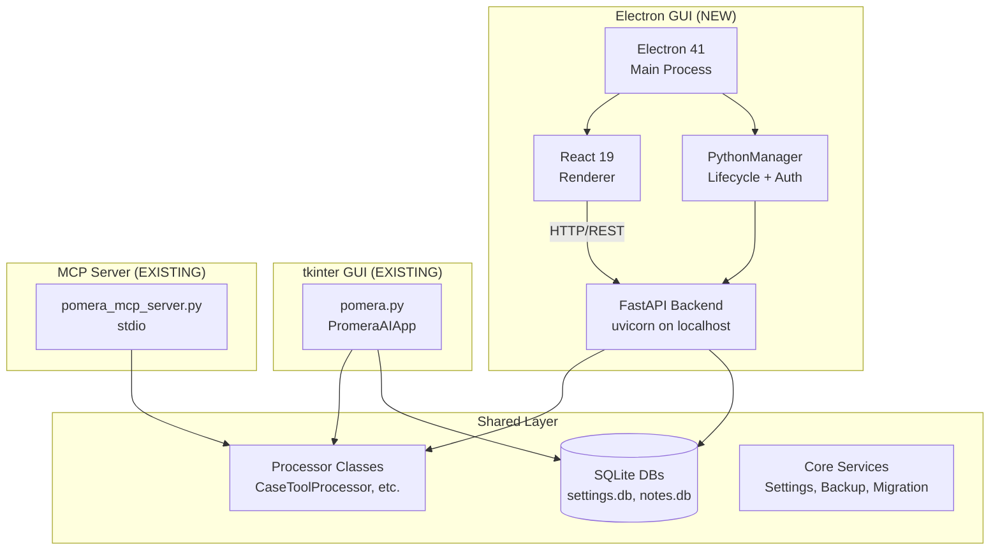

# Pomera Electron GUI — Master Build Plan (MEU Index)

## Goal

Add a modern **Electron + React 19 + TailwindCSS 4** GUI to Pomera AI Commander that runs **in parallel** with the existing tkinter GUI. Both GUIs share the same Python backend, database, and processor logic. The new GUI must achieve **full feature parity** with the existing tkinter interface.

---

## Architecture



---

## Phase Overview

| Phase | Name | Description | Est. Effort |
|-------|------|-------------|-------------|
| **P1** | FastAPI Backend | REST API wrapping Processor classes | 1-2 weeks |
| **P2** | Electron Scaffold | Electron shell + Python manager | 1 week |
| **P3** | Design System & Layout | Shared components, theme, AppShell | 1 week |
| **P4** | Text Processing Tools | Port all 26 tools with Processor classes | 2-3 weeks |
| **P5** | Standalone Widgets | Port cURL, Notes, MCP, Smart Diff, List Comparator | 2-3 weeks |
| **P6** | Settings & Persistence | Port all settings dialogs, backup/recovery | 1-2 weeks |
| **P7** | Build & Packaging | electron-builder, Python bundling | 1 week |
| **P8** | Parity Verification | Smoke tests, keyboard shortcuts, full QA | 1 week |

**Total estimated: 10-16 weeks**

---

## Phase 1: FastAPI Backend

> [!IMPORTANT]
> This is the foundation. The API wraps existing Processor classes — no business logic rewrite needed.

### P1.1 — API Scaffold

#### [NEW] `api/`
New directory at project root, modeled after [zorivest/packages/api/](file:///p:/zorivest/packages/api).

#### [NEW] `api/pyproject.toml`
Dependencies: `fastapi`, `uvicorn`, `pydantic`

#### [NEW] `api/main.py`
- FastAPI app factory with CORS, auth middleware
- Bearer token authentication (ephemeral, like [zorivest's pattern](file:///p:/zorivest/ui/src/main/python-manager.ts#L24-L27))
- `/health` endpoint for Electron health check
- `/shutdown` endpoint for graceful shutdown

#### [NEW] `api/auth.py`
- Bearer token middleware
- Token validation via environment variable `POMERA_AUTH_TOKEN`

### P1.2 — Tool API Endpoints

Each endpoint wraps an existing Processor class. The MCP [tool_registry.py](file:///p:/Pomera-AI-Commander/core/mcp/tool_registry.py#L207-L262) already maps every handler — these can be mechanically converted to REST routes.

#### [NEW] `api/routes/tools.py`
REST endpoints for all tools with existing Processor classes:

| Endpoint | Processor Source | Status |
|----------|-----------------|--------|
| `POST /api/tools/case` | `CaseToolProcessor` from [case_tool.py](file:///p:/Pomera-AI-Commander/tools/case_tool.py) | ✅ Ready |
| `POST /api/tools/line` | `LineToolsProcessor` from [line_tools.py](file:///p:/Pomera-AI-Commander/tools/line_tools.py) | ✅ Ready |
| `POST /api/tools/whitespace` | `WhitespaceToolsProcessor` from [whitespace_tools.py](file:///p:/Pomera-AI-Commander/tools/whitespace_tools.py) | ✅ Ready |
| `POST /api/tools/string-escape` | `StringEscapeProcessor` from [string_escape_tool.py](file:///p:/Pomera-AI-Commander/tools/string_escape_tool.py) | ✅ Ready |
| `POST /api/tools/sort` | `SorterToolsProcessor` from [sorter_tools.py](file:///p:/Pomera-AI-Commander/tools/sorter_tools.py) | ✅ Ready |
| `POST /api/tools/hash` | `HashGeneratorProcessor` from [hash_generator.py](file:///p:/Pomera-AI-Commander/tools/hash_generator.py) | ✅ Ready |
| `POST /api/tools/base64` | `Base64Tools.base64_processor` from [base64_tools.py](file:///p:/Pomera-AI-Commander/tools/base64_tools.py) | ✅ Ready |
| `POST /api/tools/number-base` | Inline in MCP registry (trivial function) | ✅ Ready |
| `POST /api/tools/text-stats` | `TextStatisticsProcessor` from [text_statistics_tool.py](file:///p:/Pomera-AI-Commander/tools/text_statistics_tool.py) | ✅ Ready |
| `POST /api/tools/json-xml` | `JSONXMLProcessor` from [jsonxml_tool.py](file:///p:/Pomera-AI-Commander/tools/jsonxml_tool.py) | ✅ Ready |
| `POST /api/tools/cron` | `CronToolProcessor` from [cron_tool.py](file:///p:/Pomera-AI-Commander/tools/cron_tool.py) | ✅ Ready |
| `POST /api/tools/markdown` | `MarkdownProcessor` from [markdown_tools.py](file:///p:/Pomera-AI-Commander/tools/markdown_tools.py) | ✅ Ready |
| `POST /api/tools/translator` | `TranslatorProcessor` from [translator_tools.py](file:///p:/Pomera-AI-Commander/tools/translator_tools.py) | ✅ Ready |
| `POST /api/tools/column` | `ColumnToolsProcessor` from [column_tools.py](file:///p:/Pomera-AI-Commander/tools/column_tools.py) | ✅ Ready |
| `POST /api/tools/word-freq` | `WordFrequencyProcessor` from [word_frequency_counter.py](file:///p:/Pomera-AI-Commander/tools/word_frequency_counter.py) | ✅ Ready |
| `POST /api/tools/url-parser` | `URLParserProcessor` from [url_parser.py](file:///p:/Pomera-AI-Commander/tools/url_parser.py) | ✅ Ready |
| `POST /api/tools/text-wrapper` | `TextWrapperProcessor` from [text_wrapper.py](file:///p:/Pomera-AI-Commander/tools/text_wrapper.py) | ✅ Ready |
| `POST /api/tools/slug` | `SlugGeneratorProcessor` from [slug_generator.py](file:///p:/Pomera-AI-Commander/tools/slug_generator.py) | ✅ Ready |
| `POST /api/tools/timestamp` | `TimestampProcessor` from [timestamp_converter.py](file:///p:/Pomera-AI-Commander/tools/timestamp_converter.py) | ✅ Ready |
| `POST /api/tools/ascii-art` | `ASCIIArtProcessor` from [ascii_art_generator.py](file:///p:/Pomera-AI-Commander/tools/ascii_art_generator.py) | ✅ Ready |
| `POST /api/tools/regex-extract` | `RegexExtractorProcessor` from [regex_extractor.py](file:///p:/Pomera-AI-Commander/tools/regex_extractor.py) | ✅ Ready |
| `POST /api/tools/email-extract` | `EmailExtractionProcessor` from [email_extraction_tool.py](file:///p:/Pomera-AI-Commander/tools/email_extraction_tool.py) | ✅ Ready |
| `POST /api/tools/url-extract` | `URLLinkExtractorProcessor` from [url_link_extractor.py](file:///p:/Pomera-AI-Commander/tools/url_link_extractor.py) | ✅ Ready |
| `POST /api/tools/html` | `HTMLExtractionProcessor` from [html_tool.py](file:///p:/Pomera-AI-Commander/tools/html_tool.py) | ✅ Ready |
| `POST /api/tools/email-header` | `EmailHeaderProcessor` from [email_header_analyzer.py](file:///p:/Pomera-AI-Commander/tools/email_header_analyzer.py) | ✅ Ready |
| `POST /api/tools/generator` | `GeneratorToolsProcessor` from [generator_tools.py](file:///p:/Pomera-AI-Commander/tools/generator_tools.py) | ✅ Ready |

### P1.3 — Complex Tool APIs (Require Processor Extraction)

> [!WARNING]
> These tools have **no headless Processor class** yet. The business logic is interleaved with tkinter widgets. Each needs refactoring to extract a `*Processor` class before an API endpoint can be created.

| Endpoint | Source File | Size | Extraction Difficulty |
|----------|-----------|------|----------------------|
| `POST /api/tools/find-replace` | [find_replace.py](file:///p:/Pomera-AI-Commander/tools/find_replace.py) | 104KB | Medium — regex engine is extractable |
| `POST /api/tools/diff` | [diff_viewer.py](file:///p:/Pomera-AI-Commander/tools/diff_viewer.py) | 80KB | Medium — diff logic is separable |
| `POST /api/tools/ai/*` | [ai_tools.py](file:///p:/Pomera-AI-Commander/tools/ai_tools.py) | 212KB | Hard — 11 AI providers, streaming |
| `POST /api/tools/curl` | [curl_tool.py](file:///p:/Pomera-AI-Commander/tools/curl_tool.py) | 261KB | Hard — history, cookies, auth |
| `POST /api/tools/folder-report` | [folder_file_reporter.py](file:///p:/Pomera-AI-Commander/tools/folder_file_reporter.py) | 60KB | Medium |

### P1.4 — Data APIs

#### [NEW] `api/routes/notes.py`
- `GET /api/notes` — List notes
- `GET /api/notes/{id}` — Get note
- `POST /api/notes` — Create note
- `PUT /api/notes/{id}` — Update note
- `DELETE /api/notes/{id}` — Delete note
- `GET /api/notes/search?q=` — Search notes
- Uses existing [notes.db](file:///p:/Pomera-AI-Commander/notes.db) through core modules

#### [NEW] `api/routes/settings.py`
- `GET /api/settings` — Get all settings
- `PUT /api/settings` — Update settings
- `GET /api/settings/tool/{name}` — Get tool-specific settings
- `PUT /api/settings/tool/{name}` — Update tool-specific settings
- `GET /api/settings/font` — Get font settings
- `PUT /api/settings/font` — Update font settings
- Wraps [DatabaseSettingsManager](file:///p:/Pomera-AI-Commander/core/database_settings_manager.py)

#### [NEW] `api/routes/backup.py`
- `POST /api/backup/create` — Create backup
- `GET /api/backup/history` — Backup history
- `POST /api/backup/restore/{id}` — Restore from backup
- `GET /api/backup/export` — Export settings JSON
- `POST /api/backup/import` — Import settings JSON
- Wraps [BackupRecoveryManager](file:///p:/Pomera-AI-Commander/core/backup_recovery_manager.py)

#### [NEW] `api/routes/web.py`
- `POST /api/web/search` — Web search (wraps [web_search.py](file:///p:/Pomera-AI-Commander/tools/web_search.py))
- `POST /api/web/read-url` — Read URL content (wraps [url_content_reader.py](file:///p:/Pomera-AI-Commander/tools/url_content_reader.py))

#### [NEW] `api/routes/system.py`
- `GET /api/system/dependencies` — Check optional dependencies
- `GET /api/system/data-location` — Data directory info
- `GET /api/system/version` — App version
- `POST /api/system/check-update` — Check for updates

#### [NEW] `api/routes/mcp.py`
- `GET /api/mcp/status` — MCP server status
- `POST /api/mcp/start` — Start MCP server
- `POST /api/mcp/stop` — Stop MCP server
- Wraps [mcp_widget.py](file:///p:/Pomera-AI-Commander/tools/mcp_widget.py) logic

---

## Phase 2: Electron Scaffold

Modeled directly after [zorivest/ui/](file:///p:/zorivest/ui).

### P2.1 — Project Structure

#### [NEW] `ui/package.json`
```
Dependencies: react 19, react-dom, @tanstack/react-query, @tanstack/react-router,
@tanstack/react-table, zustand, zod, radix-ui (dialog, dropdown, select, tabs, tooltip,
popover, scroll-area, slot), class-variance-authority, clsx, tailwind-merge,
lucide-react, sonner, codemirror, fuse.js, react-hook-form, @hookform/resolvers

DevDependencies: electron 41, electron-vite, electron-builder, @vitejs/plugin-react,
tailwindcss 4, @tailwindcss/vite, typescript, vitest, @testing-library/react,
@playwright/test, prettier, eslint
```

#### [NEW] `ui/electron.vite.config.ts`
Clone from [zorivest config](file:///p:/zorivest/ui/electron.vite.config.ts) with Pomera paths.

#### [NEW] `ui/electron-builder.yml`
Windows build config, icon paths, PyInstaller bundle inclusion.

#### [NEW] `ui/tsconfig.json`, `ui/tsconfig.web.json`, `ui/tsconfig.node.json`

### P2.2 — Electron Main Process

#### [NEW] `ui/src/main/index.ts`
Clone [zorivest pattern](file:///p:/zorivest/ui/src/main/index.ts):
- `createSplashWindow()` with Pomera branding
- `createMainWindow()` with dark background
- `registerIpcHandlers()` — backend URL, auth token, electron-store
- Python lifecycle management (start, health check, shutdown)

#### [NEW] `ui/src/main/python-manager.ts`
Adapted from [zorivest's PythonManager](file:///p:/zorivest/ui/src/main/python-manager.ts):
- Smart Python detection: check `python`, `python3`, system PATH
- Fallback to bundled Python if not found
- Spawn `uvicorn api.main:app` with auth token
- Health check with exponential backoff
- Graceful shutdown

#### [NEW] `ui/src/main/window-state.ts`
Window bounds persistence via electron-store.

#### [NEW] `ui/src/main/splash.html`
Pomera-branded splash screen with dog mascot.

### P2.3 — Preload Bridge

#### [NEW] `ui/src/preload/index.ts`
Secure IPC bridge exposing:
- `api.init()` — fetch backend URL + auth token
- `api.getBackendUrl()`
- `api.getAuthToken()`
- `store.get(key)` / `store.set(key, value)`
- `shell.openExternal(url)`

---

## Phase 3: Design System & Layout

### P3.1 — Theme & Tokens

#### [NEW] `ui/src/renderer/src/globals.css`
CSS custom properties for Pomera theme:
- Dark mode primary (match Pomera's existing dark purple/blue palette)
- Typography: Inter for UI, JetBrains Mono for code
- Spacing scale, border radius, transitions

#### [NEW] `ui/src/renderer/src/styles/form-guard.css`
Form dirty state indicators.

### P3.2 — Shared UI Components

#### [NEW] `ui/src/renderer/src/components/ui/`
Radix-based primitives (mirror zorivest's pattern):
- `button.tsx`, `input.tsx`, `textarea.tsx`
- `select.tsx`, `dialog.tsx`, `dropdown-menu.tsx`
- `tabs.tsx`, `tooltip.tsx`, `popover.tsx`
- `scroll-area.tsx`, `label.tsx`, `badge.tsx`
- `toaster.tsx` (sonner wrapper)

### P3.3 — Layout Shell

#### [NEW] `ui/src/renderer/src/components/layout/AppShell.tsx`
Root layout with:
- Left NavRail with tool categories
- Header with search (Ctrl+K command palette)
- Main content area
- Status footer

#### [NEW] `ui/src/renderer/src/components/layout/NavRail.tsx`
Left sidebar navigation:
- **Tools** (main text processing view)
- **AI** (AI tools with provider tabs)
- **Widgets** (cURL, Notes, MCP, Smart Diff, List Comparator)
- **Settings**
- **Help**

#### [NEW] `ui/src/renderer/src/components/layout/Header.tsx`
Top bar with:
- App title/logo
- Tool search (fuzzy, Ctrl+K)
- Theme toggle

#### [NEW] `ui/src/renderer/src/components/layout/StatusFooter.tsx`
Bottom status bar:
- Byte count, word count, sentence count, line count, token count
- (Mirror existing [input_status_bar](file:///p:/Pomera-AI-Commander/pomera.py#L3722))

### P3.4 — Command Palette

#### [NEW] `ui/src/renderer/src/components/CommandPalette.tsx`
Ctrl+K command palette with fuzzy search (fuse.js):
- All 38 tools searchable
- Sub-tools under parent categories
- Recent tools
- Keyboard shortcuts display
- (Mirror existing [ToolSearchPalette](file:///p:/Pomera-AI-Commander/core/tool_search_widget.py))

### P3.5 — Router

#### [NEW] `ui/src/renderer/src/router.tsx`
TanStack Router with hash history:
- `/` → Tools (main processing view)
- `/ai` → AI Tools (tabbed providers)
- `/widgets/curl` → cURL Tool
- `/widgets/notes` → Notes
- `/widgets/mcp` → MCP Manager
- `/widgets/smart-diff` → Smart Diff
- `/widgets/list-compare` → List Comparator
- `/settings` → Settings
- `/settings/font` → Font Settings
- `/settings/performance` → Performance Settings
- `/settings/backup` → Backup & Recovery

### P3.6 — State Management

#### [NEW] `ui/src/renderer/src/stores/tool-store.ts`
Zustand store:
- `activeTool` — currently selected tool
- `inputTabs[7]` — content for 7 input tabs
- `outputTabs[7]` — content for 7 output tabs
- `activeInputTab` / `activeOutputTab`
- `toolSettings` — per-tool settings
- `isProcessing` — loading state

#### [NEW] `ui/src/renderer/src/stores/settings-store.ts`
- Font settings, theme, export path
- UI layout preferences (panel collapsed state)
- Dialog preferences

### P3.7 — API Client

#### [NEW] `ui/src/renderer/src/lib/api-client.ts`
Typed fetch wrapper with auth header injection.

#### [NEW] `ui/src/renderer/src/lib/query-client.ts`
TanStack Query client configuration.

---

## Phase 4: Text Processing Tools

The main view: Input ↔ Tool ↔ Output pattern with 7 tabs each.

### P4.1 — Main Processing View

#### [NEW] `ui/src/renderer/src/features/tools/ToolsLayout.tsx`
Three-panel layout (mirror tkinter's `create_widgets`):
- **Left panel**: Input (7 tabs with line numbers)
- **Right panel**: Output (7 tabs with line numbers)
- **Bottom panel**: Tool options (collapsible, matches [CollapsiblePanel](file:///p:/Pomera-AI-Commander/core/collapsible_panel.py))

#### [NEW] `ui/src/renderer/src/features/tools/InputPanel.tsx`
- 7 tabs with CodeMirror text editors (line numbers)
- Load from file button
- Clear tabs button
- Export dropdown (CSV, PDF, TXT, DOCX)
- Line filter
- Save as Note button
- Status bar: Bytes | Words | Sentences | Lines | Tokens

#### [NEW] `ui/src/renderer/src/features/tools/OutputPanel.tsx`
Same as input but for output text.

#### [NEW] `ui/src/renderer/src/features/tools/ToolOptionsPanel.tsx`
Collapsible bottom panel showing active tool's options UI.

### P4.2 — Tool Option Components

One React component per tool, rendering the tool-specific settings UI:

| Component File | tkinter Source | Processor |
|---------------|---------------|-----------|
| `CaseToolOptions.tsx` | [case_tool.py](file:///p:/Pomera-AI-Commander/tools/case_tool.py) | `CaseToolProcessor` |
| `LineToolOptions.tsx` | [line_tools.py](file:///p:/Pomera-AI-Commander/tools/line_tools.py) | `LineToolsProcessor` |
| `WhitespaceToolOptions.tsx` | [whitespace_tools.py](file:///p:/Pomera-AI-Commander/tools/whitespace_tools.py) | `WhitespaceToolsProcessor` |
| `SorterToolOptions.tsx` | [sorter_tools.py](file:///p:/Pomera-AI-Commander/tools/sorter_tools.py) | `SorterToolsProcessor` |
| `StringEscapeOptions.tsx` | [string_escape_tool.py](file:///p:/Pomera-AI-Commander/tools/string_escape_tool.py) | `StringEscapeProcessor` |
| `Base64Options.tsx` | [base64_tools.py](file:///p:/Pomera-AI-Commander/tools/base64_tools.py) | `Base64Tools` |
| `HashOptions.tsx` | [hash_generator.py](file:///p:/Pomera-AI-Commander/tools/hash_generator.py) | `HashGeneratorProcessor` |
| `NumberBaseOptions.tsx` | [number_base_converter.py](file:///p:/Pomera-AI-Commander/tools/number_base_converter.py) | Inline |
| `JSONXMLOptions.tsx` | [jsonxml_tool.py](file:///p:/Pomera-AI-Commander/tools/jsonxml_tool.py) | `JSONXMLProcessor` |
| `TextStatsOptions.tsx` | [text_statistics_tool.py](file:///p:/Pomera-AI-Commander/tools/text_statistics_tool.py) | `TextStatisticsProcessor` |
| `CronOptions.tsx` | [cron_tool.py](file:///p:/Pomera-AI-Commander/tools/cron_tool.py) | `CronToolProcessor` |
| `MarkdownOptions.tsx` | [markdown_tools.py](file:///p:/Pomera-AI-Commander/tools/markdown_tools.py) | `MarkdownProcessor` |
| `TranslatorOptions.tsx` | [translator_tools.py](file:///p:/Pomera-AI-Commander/tools/translator_tools.py) | `TranslatorProcessor` |
| `ColumnOptions.tsx` | [column_tools.py](file:///p:/Pomera-AI-Commander/tools/column_tools.py) | `ColumnToolsProcessor` |
| `TextWrapperOptions.tsx` | [text_wrapper.py](file:///p:/Pomera-AI-Commander/tools/text_wrapper.py) | `TextWrapperProcessor` |
| `SlugOptions.tsx` | [slug_generator.py](file:///p:/Pomera-AI-Commander/tools/slug_generator.py) | `SlugGeneratorProcessor` |
| `TimestampOptions.tsx` | [timestamp_converter.py](file:///p:/Pomera-AI-Commander/tools/timestamp_converter.py) | `TimestampProcessor` |
| `URLParserOptions.tsx` | [url_parser.py](file:///p:/Pomera-AI-Commander/tools/url_parser.py) | `URLParserProcessor` |
| `GeneratorOptions.tsx` | [generator_tools.py](file:///p:/Pomera-AI-Commander/tools/generator_tools.py) | `GeneratorToolsProcessor` |
| `ASCIIArtOptions.tsx` | [ascii_art_generator.py](file:///p:/Pomera-AI-Commander/tools/ascii_art_generator.py) | `ASCIIArtProcessor` |
| `ExtractionOptions.tsx` | [extraction_tools.py](file:///p:/Pomera-AI-Commander/tools/extraction_tools.py) | Multiple |
| `FindReplaceOptions.tsx` | [find_replace.py](file:///p:/Pomera-AI-Commander/tools/find_replace.py) | 🔨 Extract |
| `DiffViewerOptions.tsx` | [diff_viewer.py](file:///p:/Pomera-AI-Commander/tools/diff_viewer.py) | 🔨 Extract |
| `FolderReporterOptions.tsx` | [folder_file_reporter.py](file:///p:/Pomera-AI-Commander/tools/folder_file_reporter.py) | 🔨 Extract |
| `WebSearchOptions.tsx` | [web_search.py](file:///p:/Pomera-AI-Commander/tools/web_search.py) | Headless already |
| `URLReaderOptions.tsx` | [url_content_reader.py](file:///p:/Pomera-AI-Commander/tools/url_content_reader.py) | Headless already |

### P4.3 — AI Tools (Complex)

#### [NEW] `ui/src/renderer/src/features/ai/AILayout.tsx`
Tabbed interface with 11 provider tabs:
Google AI, Vertex AI, Azure AI, Anthropic AI, OpenAI, Cohere AI, HuggingFace AI, Groq AI, OpenRouterAI, LM Studio, AWS Bedrock

Each tab needs:
- API key configuration
- Model selection dropdown
- System prompt
- Temperature/token controls
- Streaming response display
- Research mode toggle

> [!WARNING]
> **AI Tools is the largest and most complex tool** (212KB). The processor extraction for this will need to handle: streaming responses, multiple API formats, Bedrock auth, and provider-specific features. This should be done in a dedicated sub-phase.

---

## Phase 5: Standalone Widgets

These are separate windows in tkinter — they become separate routes in the Electron UI.

### P5.1 — cURL Tool
#### [NEW] `ui/src/renderer/src/features/widgets/CurlTool.tsx`
Port from [curl_tool.py](file:///p:/Pomera-AI-Commander/tools/curl_tool.py) (261KB):
- Request builder (method, URL, headers, body)
- Response viewer (status, headers, body with formatting)
- History panel
- Cookie management
- Authentication (Basic, Bearer, API Key)
- Import/Export curl commands

### P5.2 — Notes
#### [NEW] `ui/src/renderer/src/features/widgets/NotesWidget.tsx`
Port from [notes_widget.py](file:///p:/Pomera-AI-Commander/tools/notes_widget.py) (59KB):
- Note list with search
- Note editor with Markdown preview
- Categories/tags
- Encryption support
- Export/import

### P5.3 — MCP Manager
#### [NEW] `ui/src/renderer/src/features/widgets/MCPManager.tsx`
Port from [mcp_widget.py](file:///p:/Pomera-AI-Commander/tools/mcp_widget.py) (57KB):
- Server status
- Tool list
- Server start/stop
- Configuration

### P5.4 — Smart Diff
#### [NEW] `ui/src/renderer/src/features/widgets/SmartDiff.tsx`
Port from [smart_diff_widget.py](file:///p:/Pomera-AI-Commander/tools/smart_diff_widget.py) (36KB):
- 2-way diff
- 3-way merge
- Format-aware (JSON, YAML, ENV, TOML)

### P5.5 — List Comparator
#### [NEW] `ui/src/renderer/src/features/widgets/ListComparator.tsx`
Port from [list_comparator.py](file:///p:/Pomera-AI-Commander/tools/list_comparator.py) (32KB):
- Two list inputs
- Diff output (only in A, only in B, common)
- Export results

---

## Phase 6: Settings & Persistence

### P6.1 — Settings Pages

#### [NEW] `ui/src/renderer/src/features/settings/SettingsLayout.tsx`
Settings hub with sections:
- Font Settings
- Dialog Settings
- Performance Settings
- Retention Settings
- MCP Security
- Data Location
- Export Location

#### [NEW] `ui/src/renderer/src/features/settings/FontSettings.tsx`
Mirror [font settings dialog](file:///p:/Pomera-AI-Commander/pomera.py#L2759-L2818):
- Font family picker (monospace filter)
- Font size slider
- Preview

#### [NEW] `ui/src/renderer/src/features/settings/BackupRecovery.tsx`
Mirror the Settings Backup & Recovery menu:
- Create manual backup
- View backup history
- Restore from backup
- Export/Import JSON
- Repair database
- Validate integrity
- Cleanup old backups

### P6.2 — Help & About

#### [NEW] `ui/src/renderer/src/features/settings/DependenciesCheck.tsx`
Port from [dependencies check dialog](file:///p:/Pomera-AI-Commander/pomera.py#L1243-L1414).

#### [NEW] `ui/src/renderer/src/features/settings/UpdateChecker.tsx`
Check for updates dialog.

#### [NEW] `ui/src/renderer/src/features/settings/AboutDialog.tsx`
About dialog with version, links.

---

## Phase 7: Build & Packaging

### P7.1 — Development Scripts

#### [MODIFY] `ui/package.json` scripts
```json
{
  "dev": "concurrently \"npm:dev:ui\" \"npm:dev:api\"",
  "dev:ui": "cross-env POMERA_BACKEND_URL=http://127.0.0.1:17789 electron-vite dev",
  "dev:api": "cd .. && uvicorn api.main:app --host 127.0.0.1 --port 17789 --reload",
  "build": "electron-vite build",
  "package": "electron-builder"
}
```

### P7.2 — Production Build

#### [NEW] `ui/electron-builder.yml`
- Windows: NSIS installer + portable
- Include bundled Python (optional, for zero-config install)
- Include Pomera `api/`, `core/`, `tools/` directories
- Icon: existing [icon.ico](file:///p:/Pomera-AI-Commander/icon.ico)

### P7.3 — Python Detection

Smart Python detection order in `python-manager.ts`:
1. Check `POMERA_PYTHON_PATH` env var
2. Check bundled `resources/python/python.exe`
3. Check system `python3` / `python`
4. Check `.venv/Scripts/python.exe` in project dir
5. Fail with helpful error message

---

## Phase 8: Parity Verification

### P8.1 — Keyboard Shortcut Parity

| Shortcut | tkinter Action | Electron Action |
|----------|---------------|-----------------|
| `Ctrl+Z` | Undo | Undo |
| `Ctrl+Y` / `Ctrl+Shift+Z` | Redo | Redo |
| `Ctrl+S` | Save as Note | Save as Note |
| `Ctrl+N` | Open Notes | Navigate to Notes |
| `Ctrl+U` | Open cURL Tool | Navigate to cURL |
| `Ctrl+M` | Open MCP Manager | Navigate to MCP |
| `Ctrl+K` | Focus Tool Search | Open Command Palette |
| `Ctrl+Enter` | Apply Tool | Apply Tool |
| `Ctrl+Shift+H` | Toggle Options Panel | Toggle Options Panel |
| `Ctrl+Shift+P` | Load Presets | Load Presets |
| `Ctrl+D` | Smart Diff | Navigate to Smart Diff |

### P8.2 — Feature Parity Checklist

- [ ] All 38 tools process text identically
- [ ] 7 input tabs with line numbers
- [ ] 7 output tabs with line numbers
- [ ] Line filter on input/output
- [ ] Export to CSV, PDF, TXT, DOCX
- [ ] Load from file
- [ ] Status bar (bytes, words, sentences, lines, tokens)
- [ ] Font settings persist
- [ ] Tool settings persist per-tool
- [ ] Auto-save every 5 minutes
- [ ] Context menus (cut, copy, paste, select all)
- [ ] Dark mode
- [ ] Window state persistence (size, position)
- [ ] Settings backup & recovery
- [ ] Dependencies check dialog
- [ ] Data location dialog
- [ ] Update checker
- [ ] About dialog

### P8.3 — Testing Strategy

- **Unit tests**: Vitest for React components
- **Integration tests**: API endpoint tests with pytest
- **E2E tests**: Playwright for full user flows
- **Smoke test**: Verify Python manager lifecycle

---

## File Tree Summary (New Files)

```
Pomera-AI-Commander/
├── api/                              # NEW — FastAPI backend
│   ├── __init__.py
│   ├── main.py                       # App factory, CORS, auth
│   ├── auth.py                       # Bearer token middleware
│   ├── routes/
│   │   ├── tools.py                  # All tool endpoints
│   │   ├── notes.py                  # Notes CRUD
│   │   ├── settings.py               # Settings endpoints
│   │   ├── backup.py                 # Backup & recovery
│   │   ├── web.py                    # Web search, URL reader
│   │   ├── system.py                 # Dependencies, version, updates
│   │   └── mcp.py                    # MCP server management
│   └── schemas/                      # Pydantic models
│       ├── tools.py
│       ├── notes.py
│       └── settings.py
│
├── ui/                               # NEW — Electron + React
│   ├── package.json
│   ├── electron.vite.config.ts
│   ├── electron-builder.yml
│   ├── tsconfig.json
│   ├── src/
│   │   ├── main/                     # Electron main process
│   │   │   ├── index.ts
│   │   │   ├── python-manager.ts
│   │   │   ├── window-state.ts
│   │   │   └── splash.html
│   │   ├── preload/
│   │   │   └── index.ts
│   │   └── renderer/
│   │       ├── index.html
│   │       └── src/
│   │           ├── app.tsx
│   │           ├── router.tsx
│   │           ├── globals.css
│   │           ├── components/       # Shared UI components
│   │           │   ├── ui/           # Radix primitives
│   │           │   ├── layout/       # AppShell, NavRail, Header
│   │           │   └── CommandPalette.tsx
│   │           ├── features/
│   │           │   ├── tools/        # Main text processing
│   │           │   ├── ai/           # AI tools
│   │           │   ├── widgets/      # cURL, Notes, MCP, etc.
│   │           │   └── settings/     # All settings pages
│   │           ├── stores/           # Zustand stores
│   │           ├── hooks/            # Custom React hooks
│   │           ├── lib/              # API client, utils
│   │           └── styles/
│   └── tests/                        # Vitest + Playwright
│
├── core/                             # EXISTING — no changes needed
├── tools/                            # EXISTING — extract processors where missing
└── pomera.py                         # EXISTING — unchanged
```

---

## Open Questions

> [!IMPORTANT]
> 1. **Should we start with Phase 1 (FastAPI) immediately**, or do you want to review/adjust the scope first?
> 2. **Database locking**: Both GUIs access the same SQLite. Should we use WAL mode (already likely in use) and accept the concurrency model, or add an exclusive lock mechanism?
> 3. **Export formats**: The tkinter GUI exports to PDF (via reportlab) and DOCX (via python-docx). Should the Electron GUI call the Python API for these, or use JS libraries?
